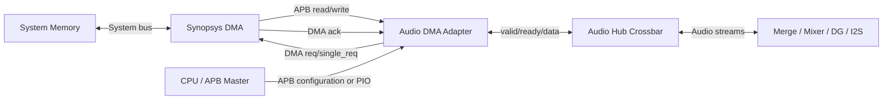
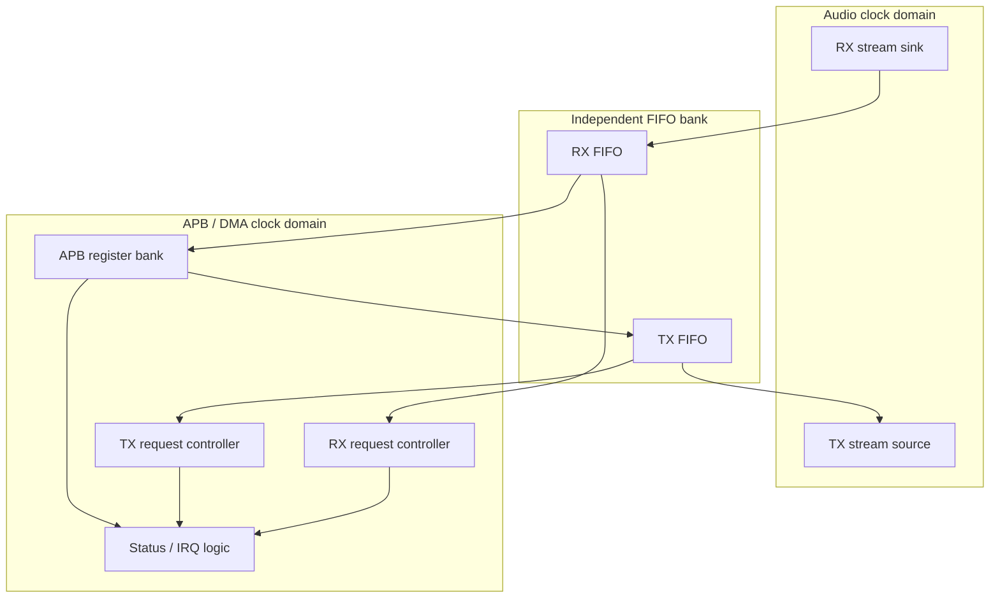
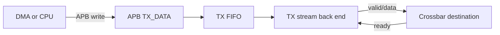

# Audio Hub DMA Adapter IP Hardware Design Description (HDD)

**Document version:** v1.0  
**Module name:** `audio_dma_adapter`  
**Target subsystem:** Audio Hub  
**Document date:** 2026-07-27  
**Data format:** 32-bit signed PCM sample  
**Audio interface:** `valid / ready / data[31:0]`  
**Programming interface:** 32-bit APB4 slave  
**DMA handshake:** Synopsys-compatible peripheral request/acknowledge signals  

---

## Revision History

| Version | Date | Description |
|---|---|---|
| v1.0 | 2026-07-27 | Initial IP-level HDD |

---

## 1. Overview

### 1.1 Purpose

`audio_dma_adapter` is the DMA endpoint of the Audio Hub. It converts between:

1. the Audio Hub internal 32-bit `valid/ready/data` streaming interface;
2. APB data-register accesses issued by a DMA controller or processor;
3. Synopsys-style peripheral DMA request/acknowledge handshakes.

The IP contains two independent paths:

- **RX path:** receives samples from the Audio Hub Crossbar, buffers them in the RX FIFO, and exposes them through the APB `RX_DATA` register for DMA or software reads;
- **TX path:** accepts samples written through the APB `TX_DATA` register, buffers them in the TX FIFO, and sends them to the Audio Hub Crossbar.

RX and TX have independent enable controls, FIFO storage, request-generation logic, status, counters, flush operations, and error reporting. A shared APB register bank controls both paths.

### 1.2 Direction Convention

All RX/TX names are defined from the Audio Hub peripheral point of view.

| Path | Audio stream direction | APB data operation | Typical system use |
|---|---|---|---|
| RX | Crossbar → DMA Adapter | DMA reads `RX_DATA` | Audio capture to memory |
| TX | DMA Adapter → Crossbar | DMA writes `TX_DATA` | Audio playback from memory |

### 1.3 Scope

This HDD defines:

- functional behavior;
- internal architecture;
- clock-domain crossing strategy;
- stream, APB, DMA handshake, interrupt, and status interfaces;
- FIFO and flow-control behavior;
- DMA request policies;
- register map and bit fields;
- state-machine behavior;
- reset, flush, error, and recovery behavior;
- verification and implementation requirements.

This HDD does **not** include RTL or RTL pseudocode.

### 1.4 Out of Scope

The following functions are outside this IP:

- DMA address generation and descriptor walking;
- system-memory access;
- DMA channel arbitration;
- PCM format conversion, gain, mixing, channel merge, or sample-rate conversion;
- I2S/TDM serialization and deserialization;
- Crossbar route selection;
- cache-coherency management.

---

## 2. Feature List

| ID | Feature |
|---|---|
| F01 | Independent RX and TX channels |
| F02 | 32-bit signed PCM sample transport |
| F03 | Audio Hub `valid/ready/data` stream interfaces |
| F04 | Independent RX and TX FIFOs |
| F05 | Optional asynchronous clock-domain crossing through the FIFOs |
| F06 | 32-bit APB4 slave register bank |
| F07 | APB RX data read port and TX data write port |
| F08 | Synopsys-compatible RX/TX block-request, single-request, and acknowledge signals |
| F09 | Configurable DMA burst length and FIFO request thresholds |
| F10 | Partial-RX timeout for draining a non-full burst |
| F11 | Independent RX/TX enable and flush |
| F12 | FIFO level, full, empty, overflow, underflow, and request status |
| F13 | Sticky error and interrupt status with write-one-to-clear |
| F14 | APB illegal-access error reporting |
| F15 | DMA acknowledge/service timeout detection |
| F16 | Debug sample and transfer counters |
| F17 | Backpressure without sample loss during legal operation |
| F18 | Parameterized FIFO depths and implementation style |

---

## 3. System Context

The system interconnect shall arbitrate DMA and CPU APB accesses before they reach this IP. The DMA Adapter exposes one APB slave port and does not arbitrate multiple APB masters internally.

### 3.1 Legal Audio Hub Connections

The DMA Adapter is an endpoint of the Crossbar and may participate in routes such as:

- `I2S RX → Crossbar → DMA RX`;
- `Merge output → Crossbar → DMA RX`;
- `Mixer output → Crossbar → DMA RX`;
- `DMA TX → Crossbar → I2S TX`;
- `DMA TX → Crossbar → Digital Gain → Crossbar → I2S TX`;
- `DMA TX → Crossbar → Merge/Mixer`.

The Crossbar routes complete stream transactions only and does not buffer samples. The DMA Adapter FIFO absorbs DMA latency and breaks combinational backpressure paths.

---

## 4. Top-Level Architecture

### 4.1 Main Sub-blocks

| Sub-block | Responsibility |
|---|---|
| RX stream front end | Accept samples from Crossbar and write them into RX FIFO |
| RX FIFO | Buffer capture samples and cross from `aud_clk` to `pclk` when required |
| RX DMA request controller | Request DMA service based on RX FIFO occupancy |
| TX APB write front end | Accept `TX_DATA` writes and write samples into TX FIFO |
| TX FIFO | Buffer playback samples and cross from `pclk` to `aud_clk` when required |
| TX stream back end | Present FIFO head sample to Crossbar with stable valid/data semantics |
| TX DMA request controller | Request DMA service based on TX FIFO free space |
| APB register bank | Configuration, status, data ports, interrupt control, and counters |
| Error/interrupt logic | Sticky event capture, masks, clear, and combined interrupt generation |

---

## 5. Data Path

### 5.1 RX Path

An RX sample is accepted only when:

`xbar_rx_valid = 1` and `xbar_rx_ready = 1`.

On that event, exactly one 32-bit sample is pushed into the RX FIFO. If the RX channel is enabled and not being flushed:

- `xbar_rx_ready` is asserted when the RX FIFO write side can accept one sample;
- `xbar_rx_ready` is deasserted when the FIFO is full;
- the upstream source shall hold `xbar_rx_valid` and `xbar_rx_data` stable while ready is low.

A successful APB read of `RX_DATA` returns and removes exactly one FIFO entry. Other APB reads do not change RX FIFO state.

### 5.2 TX Path

A successful APB write of `TX_DATA` pushes exactly one 32-bit sample into the TX FIFO.

On the stream side:

- `xbar_tx_valid` is asserted whenever the TX channel is enabled and the FIFO is non-empty;
- `xbar_tx_data` presents the current FIFO head;
- the FIFO is popped only when `xbar_tx_valid = 1` and `xbar_tx_ready = 1`;
- while `xbar_tx_valid = 1` and `xbar_tx_ready = 0`, both valid and data remain stable.

### 5.3 Sample Ordering

Both paths preserve first-in-first-out ordering. The DMA Adapter neither adds nor removes channel slots and does not interpret sample values.

One successful stream or APB data transaction transfers one complete 32-bit sample. If a multi-channel stream is used, logical slot identity is inferred from the successful transfer order established by the source IP. Software and DMA shall preserve that order.

### 5.4 Signed PCM Handling

`data[31:0]` carries a signed two's-complement PCM sample. The DMA Adapter treats the field as opaque 32-bit data:

- no arithmetic is performed;
- no sign extension or truncation is performed;
- negative samples are transported unchanged.

---

## 6. FIFO Design

### 6.1 FIFO Organization

RX and TX FIFOs are physically and logically independent.

| FIFO | Write side | Read side |
|---|---|---|
| RX FIFO | Audio stream / `aud_clk` | APB data read / `pclk` |
| TX FIFO | APB data write / `pclk` | Audio stream / `aud_clk` |

The default implementation is an asynchronous FIFO for each path. If the SoC guarantees `aud_clk` and `pclk` are the same clock, a parameterized synchronous FIFO implementation may be selected without changing visible behavior.

### 6.2 FIFO Parameters

| Parameter | Recommended default | Constraint |
|---|---:|---|
| `DATA_WIDTH` | 32 | Fixed to 32 for this subsystem revision |
| `RX_FIFO_DEPTH` | 32 | Power of two, minimum 4 |
| `TX_FIFO_DEPTH` | 32 | Power of two, minimum 4 |
| `ASYNC_FIFO_EN` | 1 | 1 for unrelated `aud_clk` and `pclk` |
| `APB_ADDR_WIDTH` | 12 | Supports 4 KiB register aperture |

The selected FIFO depth shall cover:

- maximum DMA request-to-service latency;
- the configured DMA burst length;
- APB arbitration latency;
- audio clock and APB clock ratio;
- worst-case Crossbar backpressure.

### 6.3 CDC Requirements

For asynchronous operation:

- FIFO binary pointers shall not cross clock domains directly;
- synchronized Gray-coded pointers or an equivalent proven CDC structure shall be used;
- full is generated in the write clock domain;
- empty is generated in the read clock domain;
- multi-bit FIFO data crosses only through the FIFO storage mechanism;
- FIFO level values reported across a clock boundary are approximate snapshots and may lag by synchronization latency;
- sticky error/event bits crossing to `pclk` shall use pulse stretching, toggle synchronization, or an equivalent lossless event transfer.

### 6.4 FIFO Reset and Flush

Cold reset clears both FIFOs.

RX and TX flushes are independent. A flush:

1. blocks new transactions on the affected path;
2. clears both sides of the affected FIFO using the FIFO vendor's safe reset/clear sequence;
3. clears the affected request-controller state and pending service count;
4. resets the affected partial-request timer;
5. clears the flush request when completion is observed in both clock domains;
6. sets the corresponding `FLUSH_DONE` status.

Flush discards buffered samples and shall only be issued when software accepts this data loss. Flush does not clear sticky error bits or statistical counters unless software explicitly clears them.

---

## 7. Audio Stream Interface

### 7.1 RX Stream Sink

| Port | Dir. | Width | Clock | Description |
|---|---|---:|---|---|
| `xbar_rx_valid` | I | 1 | `aud_clk` | RX input sample is valid |
| `xbar_rx_ready` | O | 1 | `aud_clk` | DMA Adapter can accept an RX sample |
| `xbar_rx_data` | I | 32 | `aud_clk` | RX signed PCM sample |

### 7.2 TX Stream Source

| Port | Dir. | Width | Clock | Description |
|---|---|---:|---|---|
| `xbar_tx_valid` | O | 1 | `aud_clk` | TX output sample is valid |
| `xbar_tx_ready` | I | 1 | `aud_clk` | Crossbar destination accepts the sample |
| `xbar_tx_data` | O | 32 | `aud_clk` | TX signed PCM sample |

### 7.3 Backpressure Rules

- RX backpressure propagates only from RX FIFO full state to `xbar_rx_ready`.
- TX backpressure is absorbed by retaining the TX FIFO head until accepted.
- There is no direct combinational path from `xbar_tx_ready` to `xbar_rx_ready`.
- APB/DMA timing shall not create a combinational path into the Crossbar.
- Disabling a channel prevents new stream transfers but does not implicitly flush its FIFO.

---

## 8. APB Slave Interface

### 8.1 Port List

| Port | Dir. | Width | Clock | Description |
|---|---|---:|---|---|
| `pclk` | I | 1 | — | APB and DMA handshake clock |
| `presetn` | I | 1 | `pclk` | Active-low APB-domain reset |
| `psel` | I | 1 | `pclk` | APB slave select |
| `penable` | I | 1 | `pclk` | APB access phase |
| `pwrite` | I | 1 | `pclk` | 1: write, 0: read |
| `paddr` | I | 12 | `pclk` | Byte address within 4 KiB aperture |
| `pwdata` | I | 32 | `pclk` | Write data |
| `pstrb` | I | 4 | `pclk` | Byte write strobes |
| `pprot` | I | 3 | `pclk` | APB protection attributes; not functionally decoded |
| `prdata` | O | 32 | `pclk` | Read data |
| `pready` | O | 1 | `pclk` | Transfer completion |
| `pslverr` | O | 1 | `pclk` | Access error indication |

### 8.2 APB Behavior

- All control/status registers are naturally aligned 32-bit words.
- Unmapped or misaligned accesses complete with `pready = 1` and `pslverr = 1`.
- Read-only register writes complete with `pslverr = 1` and have no side effect.
- Write-only register reads complete with `pslverr = 1` and return zero.
- Reserved bits read as zero and shall be written as zero.
- `pstrb` is honored for ordinary read/write control registers.
- `RX_DATA` reads and `TX_DATA` writes require all byte strobes active where applicable; partial data-port accesses return `pslverr = 1` and do not change FIFO state.
- Except for reset/flush synchronization, the APB slave does not insert wait states.

### 8.3 APB Data-Port Error Behavior

| Access | Condition | Result |
|---|---|---|
| Read `RX_DATA` | RX FIFO non-empty | Return and pop one sample |
| Read `RX_DATA` | RX FIFO empty | Return zero, assert `pslverr`, set RX underflow sticky bit |
| Write `TX_DATA` | TX FIFO not full | Push one sample |
| Write `TX_DATA` | TX FIFO full | Assert `pslverr`, discard write, set TX overflow sticky bit |

An invalid data access does not corrupt FIFO pointers or consume a DMA service credit.

---

## 9. DMA Handshake Interface

### 9.1 Port List

| Port | Dir. | Width | Clock | Description |
|---|---|---:|---|---|
| `dma_rx_req` | O | 1 | `pclk` | RX block/burst service request |
| `dma_rx_single_req` | O | 1 | `pclk` | RX single-transfer service request |
| `dma_rx_ack` | I | 1 | `pclk` | DMA acceptance of RX request |
| `dma_tx_req` | O | 1 | `pclk` | TX block/burst service request |
| `dma_tx_single_req` | O | 1 | `pclk` | TX single-transfer service request |
| `dma_tx_ack` | I | 1 | `pclk` | DMA acceptance of TX request |

The request and acknowledge signals are synchronous to `pclk`. If the connected DMA controller produces acknowledgements in another clock domain, synchronization is required outside this IP.

### 9.2 Signal Meaning

| Signal | Meaning |
|---|---|
| `dma_rx_req` | RX FIFO contains enough samples for one configured block/burst service |
| `dma_rx_single_req` | RX FIFO requires a one-sample service |
| `dma_rx_ack` | DMA has accepted the currently asserted RX request |
| `dma_tx_req` | TX FIFO has enough free entries for one configured block/burst service |
| `dma_tx_single_req` | TX FIFO requires a one-sample service |
| `dma_tx_ack` | DMA has accepted the currently asserted TX request |

For each direction, `req` and `single_req` are mutually exclusive.

### 9.3 Request/Acknowledge Contract

The integration uses a level request and acknowledge contract:

1. the DMA Adapter asserts one request type;
2. the request remains asserted until the matching `dma_*_ack` is sampled high;
3. the DMA Adapter deasserts the request after acknowledgement;
4. the DMA Controller deasserts acknowledgement after observing request deassertion;
5. the DMA performs the corresponding APB data access or accesses.

`dma_*_ack` indicates that the request was accepted. It does **not** itself pop or push FIFO data.

FIFO data movement is authoritative only on:

- a successful APB read of `RX_DATA`;
- a successful APB write of `TX_DATA`.

This separation prevents acknowledgement timing from duplicating or dropping a sample.

### 9.4 Service Size

| Request type | Expected successful APB data transfers |
|---|---:|
| `dma_*_single_req` | 1 |
| `dma_*_req` | `BURST_LEN` |

`BURST_LEN` is independently programmable for RX and TX and shall match the DMA channel's source/destination burst configuration.

The DMA Adapter permits at most one accepted but incomplete service per direction. RX and TX may each have one service outstanding concurrently.

### 9.5 RX Request Generation

Let:

- `rx_level` be the number of readable RX FIFO entries in the `pclk` domain;
- `RX_BURST_LEVEL` be the configured burst request threshold;
- `RX_SINGLE_LEVEL` be the configured minimum single-request threshold;
- `RX_BURST_LEN` be the expected number of APB reads for a block request.

When no RX service is pending:

1. if burst requests are enabled and `rx_level >= RX_BURST_LEVEL`, assert `dma_rx_req`;
2. otherwise, if single requests are enabled and the single-request condition is met, assert `dma_rx_single_req`;
3. burst request has priority when both conditions become true in the same cycle.

To avoid immediately draining every sample as a single transfer and thereby preventing efficient bursts, the recommended single-request condition is:

- RX FIFO reaches `RX_SINGLE_LEVEL` and the programmable partial-RX timer expires; or
- software requests tail drain; or
- burst request generation is disabled.

The default `RX_BURST_LEVEL` shall be greater than or equal to `RX_BURST_LEN`.

### 9.6 TX Request Generation

Let:

- `tx_free` be the number of writable TX FIFO entries in the `pclk` domain;
- `TX_BURST_SPACE` be the configured block-request free-space threshold;
- `TX_SINGLE_SPACE` be the configured single-request free-space threshold;
- `TX_BURST_LEN` be the expected number of APB writes for a block request.

When no TX service is pending:

1. if burst requests are enabled and `tx_free >= TX_BURST_SPACE`, assert `dma_tx_req`;
2. otherwise, if single requests are enabled and `tx_free >= TX_SINGLE_SPACE`, assert `dma_tx_single_req`;
3. burst request has priority when both conditions become true in the same cycle.

The default `TX_BURST_SPACE` shall be greater than or equal to `TX_BURST_LEN`.

### 9.7 Service Accounting

After acknowledgement, a per-direction service counter records successful `RX_DATA` reads or `TX_DATA` writes.

- A single service completes after one successful data access.
- A block service completes after `BURST_LEN` successful data accesses.
- Failed APB accesses do not increment the counter.
- No new request is generated until the accepted service completes.
- APB data accesses without a pending DMA service are legal processor-programmed I/O and update the FIFO and APB-access counters, but not the DMA service counter.

Because an APB data access does not identify its master, system software shall not perform PIO data-port accesses while the corresponding DMA channel is enabled. A `DMA_OWNER` control bit optionally enforces this rule by rejecting unaccounted data accesses during active DMA operation.

### 9.8 Timeout Handling

Two independent timeouts may be enabled:

- **ACK timeout:** request remains unacknowledged longer than `ACK_TIMEOUT`;
- **service timeout:** request was acknowledged, but the expected number of successful APB data accesses does not complete within `SERVICE_TIMEOUT`.

On timeout:

- set the corresponding sticky error and interrupt status;
- deassert the request;
- cancel the outstanding service credit;
- retain all FIFO contents;
- stop automatic requests for the affected direction until software clears the error or flushes/re-enables the channel, according to `HALT_ON_TIMEOUT`.

Timeout recovery never fabricates an APB data transfer.

### 9.9 Required DMA Integration

The DMA channel shall be configured consistently with this IP:

| RX DMA channel setting | Requirement |
|---|---|
| Transfer direction | Peripheral-to-memory |
| Peripheral address | `RX_DATA` register address |
| Peripheral width | 32 bits |
| Peripheral address increment | Disabled |
| Burst length | Equal to `RX_BURST_LEN` for block requests |

| TX DMA channel setting | Requirement |
|---|---|
| Transfer direction | Memory-to-peripheral |
| Peripheral address | `TX_DATA` register address |
| Peripheral width | 32 bits |
| Peripheral address increment | Disabled |
| Burst length | Equal to `TX_BURST_LEN` for block requests |

The exact Synopsys DMA polarity and handshake mapping shall be confirmed at SoC integration. This IP defines all request and acknowledge signals as active high.

---

## 10. State-Machine Behavior

RX and TX use independent request-control state machines with equivalent control structure.

### 10.1 Request FSM States

| State | Description | Exit condition |
|---|---|---|
| `DISABLED` | Channel or DMA request generation is disabled | Channel and request generation enabled |
| `IDLE` | No request or accepted service is pending | Single/block request condition |
| `WAIT_ACK` | Selected request is held asserted | Matching ACK sampled, timeout, disable, reset, or flush |
| `SERVICE` | Request is low; counts successful APB data accesses and observes ACK return low | Expected service count reached and ACK low, timeout, disable, reset, or flush |
| `WAIT_ACK_LOW` | Expected data service completed before a level ACK returned low | ACK low |
| `ERROR_HALT` | Automatic requests stopped after fatal timeout/protocol error | Software clear/re-enable, reset, or flush |

### 10.2 State Ordering

For a normal request:

Typical level-handshake sequence:

`IDLE → WAIT_ACK → SERVICE → IDLE`

The `SERVICE` state starts as soon as ACK is sampled, so APB data transfers may be counted even if the level ACK is still high. The state returns to `IDLE` only after both the expected data-transfer count has completed and ACK is low.

If the expected data service completes while ACK remains high:

`SERVICE → WAIT_ACK_LOW → IDLE`

`WAIT_ACK_LOW` prevents a still-high acknowledgement from being interpreted as the acknowledgement of a new request.

If the DMA implementation guarantees a one-cycle ACK pulse and the integration option `ACK_PULSE_MODE` is selected, `WAIT_ACK_LOW` may complete immediately after the pulse is sampled.

### 10.3 Abort Rules

- Reset cancels the state machine immediately and clears pending service state.
- Flush cancels pending service state and follows the safe FIFO flush sequence.
- Channel disable deasserts new requests; if `GRACEFUL_DISABLE = 1`, an already acknowledged service may complete before entering `DISABLED`.
- If `GRACEFUL_DISABLE = 0`, disable cancels accounting immediately but does not alter FIFO contents.

The recommended default is graceful disable.

---

## 11. Interrupts and Status

### 11.1 Interrupt Output

| Port | Dir. | Width | Clock | Description |
|---|---|---:|---|---|
| `irq` | O | 1 | `pclk` | Combined active-high level interrupt |

`irq` is asserted when any enabled bit in `IRQ_STATUS` is set:

`irq = |(IRQ_STATUS & IRQ_MASK)`.

All event bits are sticky until cleared through `IRQ_CLEAR` or cold reset. Clearing an interrupt does not correct the underlying condition.

### 11.2 Interrupt Sources

| Bit | Event |
|---:|---|
| 0 | RX FIFO reaches programmed watermark |
| 1 | TX FIFO reaches programmed low watermark |
| 2 | RX FIFO overflow attempt |
| 3 | RX `RX_DATA` underflow read |
| 4 | TX `TX_DATA` overflow write |
| 5 | TX stream starvation/underflow |
| 6 | RX DMA ACK timeout |
| 7 | RX DMA service timeout |
| 8 | TX DMA ACK timeout |
| 9 | TX DMA service timeout |
| 10 | RX flush complete |
| 11 | TX flush complete |
| 12 | APB illegal access |
| 13 | DMA handshake protocol error |
| 14 | RX counter wrap |
| 15 | TX counter wrap |

### 11.3 Error Definitions

- **RX overflow attempt:** internal RX FIFO write logic attempts a write while the FIFO is full. A compliant stream source is allowed to hold `valid = 1` while `ready = 0`; that condition alone is not an overflow.
- **RX data underflow:** `RX_DATA` is read while RX FIFO is empty.
- **TX data overflow:** `TX_DATA` is written while TX FIFO is full.
- **TX stream starvation:** TX is enabled, playback has started, and the TX FIFO becomes empty before an explicit stop/drain condition.
- **DMA protocol error:** illegal simultaneous conditions such as request-type overlap caused by external forcing, ACK while no request/service is eligible, or inconsistent service accounting.

---

## 12. Register Map

### 12.1 Register Summary

| Offset | Register | Access | Reset | Description |
|---:|---|---|---:|---|
| `0x000` | `IP_ID` | RO | Implementation defined | IP identification |
| `0x004` | `IP_VERSION` | RO | `0x0001_0000` | Version 1.0 |
| `0x008` | `GLOBAL_CTRL` | RW | `0x0000_0000` | Global enable and reset/flush controls |
| `0x00C` | `GLOBAL_STATUS` | RO | `0x0000_0000` | Global busy and active status |
| `0x010` | `IRQ_STATUS` | RO | `0x0000_0000` | Raw sticky interrupt status |
| `0x014` | `IRQ_MASK` | RW | `0x0000_0000` | Interrupt enable mask |
| `0x018` | `IRQ_CLEAR` | WO/W1C | — | Clear sticky interrupt bits |
| `0x01C` | `ERROR_STATUS` | RO | `0x0000_0000` | Sticky error summary |
| `0x020` | `ERROR_CLEAR` | WO/W1C | — | Clear sticky error bits |
| `0x040` | `RX_CTRL` | RW | `0x0000_0000` | RX channel controls |
| `0x044` | `RX_FIFO_CFG` | RW | See bit fields | RX thresholds |
| `0x048` | `RX_DMA_CFG` | RW | See bit fields | RX DMA request configuration |
| `0x04C` | `RX_TIMEOUT_CFG` | RW | `0x0000_0000` | RX partial/ACK/service timeouts |
| `0x050` | `RX_STATUS` | RO | `0x0000_0002` | RX state and FIFO flags |
| `0x054` | `RX_FIFO_LEVEL` | RO | `0x0000_0000` | RX readable entry count |
| `0x058` | `RX_SAMPLE_COUNT` | RW1C | `0x0000_0000` | Successful RX stream samples |
| `0x05C` | `RX_APB_COUNT` | RW1C | `0x0000_0000` | Successful RX data reads |
| `0x060` | `RX_DROP_COUNT` | RW1C | `0x0000_0000` | RX overflow/integration attempts |
| `0x080` | `TX_CTRL` | RW | `0x0000_0000` | TX channel controls |
| `0x084` | `TX_FIFO_CFG` | RW | See bit fields | TX thresholds |
| `0x088` | `TX_DMA_CFG` | RW | See bit fields | TX DMA request configuration |
| `0x08C` | `TX_TIMEOUT_CFG` | RW | `0x0000_0000` | TX ACK/service timeouts |
| `0x090` | `TX_STATUS` | RO | `0x0000_0002` | TX state and FIFO flags |
| `0x094` | `TX_FIFO_LEVEL` | RO | `0x0000_0000` | TX occupied/free entry count |
| `0x098` | `TX_SAMPLE_COUNT` | RW1C | `0x0000_0000` | Successful TX stream samples |
| `0x09C` | `TX_APB_COUNT` | RW1C | `0x0000_0000` | Successful TX data writes |
| `0x0A0` | `TX_STARVE_COUNT` | RW1C | `0x0000_0000` | TX starvation events |
| `0x100` | `RX_DATA` | RO | — | RX FIFO read data port |
| `0x104` | `TX_DATA` | WO | — | TX FIFO write data port |
| `0x108` | `FIFO_CAPABILITY` | RO | Parameter derived | FIFO depths and capabilities |
| `0x10C` | `DEBUG_STATUS` | RO | `0x0000_0000` | Request FSM and pending counts |

Registers from `0x110` through `0xFFF` are reserved.

### 12.2 `GLOBAL_CTRL` — `0x008`

| Bits | Field | Access | Reset | Description |
|---|---|---|---:|---|
| 0 | `GLOBAL_EN` | RW | 0 | Global functional enable |
| 1 | `RX_FLUSH` | WO/SC | 0 | Start RX FIFO flush |
| 2 | `TX_FLUSH` | WO/SC | 0 | Start TX FIFO flush |
| 3 | `SOFT_RESET` | WO/SC | 0 | Reset functional state, FIFOs, and counters; APB remains accessible |
| 4 | `FREEZE_COUNTERS` | RW | 0 | Freeze debug/statistical counters |
| 31:5 | Reserved | — | 0 | Write zero |

`SOFT_RESET` clears FIFO contents, channel state, pending DMA service state, sticky status, and counters. Configuration registers return to reset values.

### 12.3 `GLOBAL_STATUS` — `0x00C`

| Bits | Field | Description |
|---|---|---|
| 0 | `GLOBAL_ACTIVE` | Global enable is active |
| 1 | `RX_ACTIVE` | RX channel active |
| 2 | `TX_ACTIVE` | TX channel active |
| 3 | `RX_FLUSH_BUSY` | RX flush in progress |
| 4 | `TX_FLUSH_BUSY` | TX flush in progress |
| 5 | `RX_DMA_BUSY` | RX request or service outstanding |
| 6 | `TX_DMA_BUSY` | TX request or service outstanding |
| 7 | `IRQ_PENDING` | At least one enabled interrupt pending |
| 31:8 | Reserved | Read zero |

### 12.4 `IRQ_STATUS`, `IRQ_MASK`, and `IRQ_CLEAR`

Bits `[15:0]` use the encoding in Section 11.2.

- `IRQ_STATUS` exposes raw sticky events.
- `IRQ_MASK[n] = 1` enables event `n` to assert `irq`.
- Writing one to `IRQ_CLEAR[n]` clears event `n`.
- Writing zero has no effect.

### 12.5 `ERROR_STATUS` and `ERROR_CLEAR`

| Bit | Error |
|---:|---|
| 0 | RX overflow attempt |
| 1 | RX APB underflow |
| 2 | TX APB overflow |
| 3 | TX stream starvation |
| 4 | RX ACK timeout |
| 5 | RX service timeout |
| 6 | TX ACK timeout |
| 7 | TX service timeout |
| 8 | APB illegal access |
| 9 | DMA protocol error |
| 31:10 | Reserved |

`ERROR_CLEAR` is write-one-to-clear. A timeout-halted channel returns to request-eligible state only after its error is cleared and the underlying enable/configuration remains valid.

### 12.6 `RX_CTRL` — `0x040`

| Bits | Field | Access | Reset | Description |
|---|---|---|---:|---|
| 0 | `RX_EN` | RW | 0 | Enable RX stream acceptance |
| 1 | `RX_DMA_EN` | RW | 0 | Enable RX DMA request generation |
| 2 | `RX_BURST_REQ_EN` | RW | 0 | Enable `dma_rx_req` |
| 3 | `RX_SINGLE_REQ_EN` | RW | 0 | Enable `dma_rx_single_req` |
| 4 | `RX_TAIL_DRAIN` | WO/SC | 0 | Allow pending partial RX data to request single service |
| 5 | `DMA_OWNER` | RW | 0 | Reject non-accounted PIO data access while DMA service mode is active |
| 6 | `GRACEFUL_DISABLE` | RW | 1 | Complete acknowledged service before disabling |
| 7 | `HALT_ON_TIMEOUT` | RW | 1 | Stop requests after ACK/service timeout |
| 31:8 | Reserved | — | 0 | Write zero |

### 12.7 `RX_FIFO_CFG` — `0x044`

| Bits | Field | Access | Reset | Description |
|---|---|---|---:|---|
| 7:0 | `RX_BURST_LEVEL` | RW | 16 | Occupancy needed for burst request |
| 15:8 | `RX_SINGLE_LEVEL` | RW | 1 | Minimum occupancy for single request |
| 23:16 | `RX_IRQ_LEVEL` | RW | 24 | Occupancy watermark interrupt |
| 31:24 | Reserved | — | 0 | Write zero |

Each threshold shall be in the range `1..RX_FIFO_DEPTH`. An illegal value is rejected with `pslverr` and no register update.

### 12.8 `RX_DMA_CFG` — `0x048`

| Bits | Field | Access | Reset | Description |
|---|---|---|---:|---|
| 4:0 | `RX_BURST_LEN` | RW | 8 | Transfers expected for block request; legal 1, 4, 8, or 16 |
| 5 | `ACK_PULSE_MODE` | RW | 0 | 1: ACK is a pulse; 0: four-phase level handshake |
| 6 | `ALLOW_PIO_WHILE_DMA_EN` | RW | 0 | Permit unaccounted data reads when no service is outstanding |
| 31:7 | Reserved | — | 0 | Write zero |

`RX_BURST_LEVEL` shall be greater than or equal to `RX_BURST_LEN`.

### 12.9 `RX_TIMEOUT_CFG` — `0x04C`

| Bits | Field | Access | Reset | Description |
|---|---|---|---:|---|
| 7:0 | `PARTIAL_TIMEOUT` | RW | 0 | Partial RX wait in units of 256 `pclk`; 0 disables |
| 15:8 | `ACK_TIMEOUT` | RW | 0 | ACK wait in units of 256 `pclk`; 0 disables |
| 23:16 | `SERVICE_TIMEOUT` | RW | 0 | Service wait in units of 256 `pclk`; 0 disables |
| 31:24 | Reserved | — | 0 | Write zero |

### 12.10 `RX_STATUS` — `0x050`

| Bits | Field | Description |
|---|---|---|
| 0 | `FIFO_FULL` | RX FIFO full |
| 1 | `FIFO_EMPTY` | RX FIFO empty |
| 2 | `BURST_REQ` | `dma_rx_req` state |
| 3 | `SINGLE_REQ` | `dma_rx_single_req` state |
| 4 | `ACK` | Synchronized `dma_rx_ack` |
| 5 | `SERVICE_ACTIVE` | Accepted RX service incomplete |
| 6 | `TIMEOUT_HALT` | RX requests halted by timeout |
| 7 | `PARTIAL_TIMER_ACTIVE` | Partial RX timer running |
| 11:8 | `FSM_STATE` | Encoded RX request state |
| 31:12 | Reserved | Read zero |

### 12.11 `RX_FIFO_LEVEL` — `0x054`

| Bits | Field | Description |
|---|---|---|
| 15:0 | `OCCUPIED` | Readable RX entries |
| 31:16 | `FREE` | Available RX entries |

### 12.12 RX Counters

- `RX_SAMPLE_COUNT`: increments on successful `xbar_rx_valid && xbar_rx_ready`.
- `RX_APB_COUNT`: increments on successful `RX_DATA` read.
- `RX_DROP_COUNT`: increments only on an internal protected-write/full violation; legal upstream backpressure does not increment it.
- Writing any value to a counter register clears that counter to zero.
- Counter wrap sets the RX counter-wrap interrupt.

### 12.13 `TX_CTRL` — `0x080`

| Bits | Field | Access | Reset | Description |
|---|---|---|---:|---|
| 0 | `TX_EN` | RW | 0 | Enable TX stream transmission |
| 1 | `TX_DMA_EN` | RW | 0 | Enable TX DMA request generation |
| 2 | `TX_BURST_REQ_EN` | RW | 0 | Enable `dma_tx_req` |
| 3 | `TX_SINGLE_REQ_EN` | RW | 0 | Enable `dma_tx_single_req` |
| 4 | `TX_STARVE_DETECT_EN` | RW | 0 | Enable playback starvation detection |
| 5 | `DMA_OWNER` | RW | 0 | Reject non-accounted PIO data access while DMA service mode is active |
| 6 | `GRACEFUL_DISABLE` | RW | 1 | Complete acknowledged service before disabling |
| 7 | `HALT_ON_TIMEOUT` | RW | 1 | Stop requests after ACK/service timeout |
| 8 | `TX_START_ARM` | WO/SC | 0 | Arm starvation detection after initial FIFO fill |
| 31:9 | Reserved | — | 0 | Write zero |

### 12.14 `TX_FIFO_CFG` — `0x084`

| Bits | Field | Access | Reset | Description |
|---|---|---|---:|---|
| 7:0 | `TX_BURST_SPACE` | RW | 8 | Free entries needed for burst request |
| 15:8 | `TX_SINGLE_SPACE` | RW | 1 | Free entries needed for single request |
| 23:16 | `TX_IRQ_LEVEL` | RW | 8 | Occupancy at or below which low-level IRQ is set |
| 31:24 | `TX_START_LEVEL` | RW | 16 | Recommended initial-fill level before enabling stream |

Thresholds shall be within the implemented FIFO depth. An illegal value is rejected.

### 12.15 `TX_DMA_CFG` — `0x088`

| Bits | Field | Access | Reset | Description |
|---|---|---|---:|---|
| 4:0 | `TX_BURST_LEN` | RW | 8 | Transfers expected for block request; legal 1, 4, 8, or 16 |
| 5 | `ACK_PULSE_MODE` | RW | 0 | 1: ACK is a pulse; 0: four-phase level handshake |
| 6 | `ALLOW_PIO_WHILE_DMA_EN` | RW | 0 | Permit unaccounted data writes when no service is outstanding |
| 31:7 | Reserved | — | 0 | Write zero |

`TX_BURST_SPACE` shall be greater than or equal to `TX_BURST_LEN`.

### 12.16 `TX_TIMEOUT_CFG` — `0x08C`

| Bits | Field | Access | Reset | Description |
|---|---|---|---:|---|
| 7:0 | `ACK_TIMEOUT` | RW | 0 | ACK wait in units of 256 `pclk`; 0 disables |
| 15:8 | `SERVICE_TIMEOUT` | RW | 0 | Service wait in units of 256 `pclk`; 0 disables |
| 31:16 | Reserved | — | 0 | Write zero |

### 12.17 `TX_STATUS` — `0x090`

| Bits | Field | Description |
|---|---|---|
| 0 | `FIFO_FULL` | TX FIFO full |
| 1 | `FIFO_EMPTY` | TX FIFO empty |
| 2 | `BURST_REQ` | `dma_tx_req` state |
| 3 | `SINGLE_REQ` | `dma_tx_single_req` state |
| 4 | `ACK` | Synchronized `dma_tx_ack` |
| 5 | `SERVICE_ACTIVE` | Accepted TX service incomplete |
| 6 | `TIMEOUT_HALT` | TX requests halted by timeout |
| 7 | `PLAYBACK_ARMED` | Starvation detection armed |
| 11:8 | `FSM_STATE` | Encoded TX request state |
| 31:12 | Reserved | Read zero |

### 12.18 `TX_FIFO_LEVEL` — `0x094`

| Bits | Field | Description |
|---|---|---|
| 15:0 | `OCCUPIED` | TX entries containing samples |
| 31:16 | `FREE` | Available TX entries |

### 12.19 TX Counters

- `TX_SAMPLE_COUNT`: increments on successful `xbar_tx_valid && xbar_tx_ready`.
- `TX_APB_COUNT`: increments on successful `TX_DATA` write.
- `TX_STARVE_COUNT`: increments once per transition into starvation.
- Writing any value to a counter register clears that counter to zero.
- Counter wrap sets the TX counter-wrap interrupt.

### 12.20 `FIFO_CAPABILITY` — `0x108`

| Bits | Field | Description |
|---|---|---|
| 7:0 | `RX_DEPTH` | Implemented RX FIFO depth |
| 15:8 | `TX_DEPTH` | Implemented TX FIFO depth |
| 16 | `ASYNC_FIFO` | 1: asynchronous FIFO implementation |
| 17 | `BURST_SUPPORTED` | 1: block request supported |
| 18 | `SINGLE_SUPPORTED` | 1: single request supported |
| 31:19 | Reserved | Read zero |

### 12.21 `DEBUG_STATUS` — `0x10C`

| Bits | Field | Description |
|---|---|---|
| 4:0 | `RX_SERVICE_REMAIN` | Expected successful RX reads remaining |
| 9:5 | `TX_SERVICE_REMAIN` | Expected successful TX writes remaining |
| 13:10 | `RX_FSM_STATE` | RX request FSM state |
| 17:14 | `TX_FSM_STATE` | TX request FSM state |
| 18 | `RX_REQ_ELIGIBLE` | RX threshold logic requests service |
| 19 | `TX_REQ_ELIGIBLE` | TX threshold logic requests service |
| 31:20 | Reserved | Read zero |

---

## 13. Configuration and Operating Sequences

### 13.1 RX DMA Capture Start

1. Keep `RX_EN = 0` and `RX_DMA_EN = 0`.
2. Flush RX FIFO and wait for `RX_FLUSH_BUSY = 0`.
3. Program RX FIFO thresholds, burst length, partial timeout, and DMA timeouts.
4. Configure the external DMA channel for peripheral-to-memory transfers from `RX_DATA`.
5. Clear stale RX error and interrupt status.
6. Enable desired interrupt masks.
7. Set `RX_EN = 1`.
8. Enable the external DMA channel.
9. Set `RX_DMA_EN = 1`.

### 13.2 RX DMA Capture Stop

1. Stop the upstream audio source at a frame boundary where possible.
2. Issue `RX_TAIL_DRAIN` to service residual samples below burst threshold.
3. Wait until RX FIFO is empty and no RX DMA service is active.
4. Clear `RX_DMA_EN`.
5. Disable the external DMA channel.
6. Clear `RX_EN`.

If residual samples may be discarded, software may disable the channel and flush the RX FIFO instead.

### 13.3 TX DMA Playback Start

1. Keep `TX_EN = 0` and `TX_DMA_EN = 0`.
2. Flush TX FIFO and wait for completion.
3. Program TX thresholds, burst length, and DMA timeouts.
4. Configure the external DMA channel for memory-to-peripheral transfers to `TX_DATA`.
5. Clear stale TX error and interrupt status.
6. Enable the external DMA channel.
7. Set `TX_DMA_EN = 1` to prefill the TX FIFO.
8. Wait until `TX_FIFO_LEVEL.OCCUPIED >= TX_START_LEVEL`.
9. Issue `TX_START_ARM` if starvation detection is required.
10. Set `TX_EN = 1`.

### 13.4 TX DMA Playback Stop

For drain-and-stop:

1. prevent the DMA from starting another block;
2. wait for any acknowledged service to complete;
3. clear `TX_DMA_EN`;
4. wait until the TX FIFO is empty;
5. clear `TX_EN`;
6. disable the external DMA channel.

For immediate stop, clear `TX_EN`, clear `TX_DMA_EN`, disable the DMA channel, and flush TX FIFO.

### 13.5 Processor-Programmed I/O

The processor may use:

- `RX_DATA` reads for low-rate capture or debug;
- `TX_DATA` writes for low-rate playback or debug.

PIO and DMA shall not access the same path concurrently unless explicitly allowed by configuration and coordinated by software.

---

## 14. Reset and Clock Behavior

### 14.1 Reset Inputs

| Port | Dir. | Width | Domain | Description |
|---|---|---:|---|---|
| `aud_clk` | I | 1 | Audio | Crossbar stream clock |
| `aud_rst_n` | I | 1 | Audio | Active-low audio-domain reset |
| `pclk` | I | 1 | APB/DMA | APB, DMA handshake, register-bank clock |
| `presetn` | I | 1 | APB/DMA | Active-low APB-domain reset |

### 14.2 Reset Requirements

- Reset assertion may be asynchronous.
- Reset deassertion shall be synchronized independently in each clock domain.
- Either domain reset causes the corresponding FIFO side to become inactive.
- Normal operation resumes only after both FIFO domains have completed reset synchronization.
- During reset, request outputs, `xbar_tx_valid`, and `irq` are low.
- During reset, `xbar_rx_ready` is low.
- No stale FIFO data may appear after reset.

### 14.3 Clock Gating

Clock gating is allowed only when:

- the affected channel is disabled;
- no DMA request or service is outstanding;
- the associated FIFO flush/reset handshake is complete;
- no APB access is active.

For asynchronous FIFO implementations, gating one domain must not violate the FIFO vendor macro's pointer-synchronization and reset requirements.

---

## 15. Functional Corner Cases

### 15.1 RX FIFO Becomes Full

The adapter deasserts `xbar_rx_ready`. A compliant source retains the sample and no data is lost. DMA block request has priority over single request when enough entries exist.

### 15.2 TX FIFO Becomes Empty

The adapter deasserts `xbar_tx_valid`. If playback starvation detection is armed, the transition to empty sets sticky status and increments `TX_STARVE_COUNT`.

### 15.3 ACK Arrives Without Request

An ACK sampled while neither a matching request nor a valid acknowledgement phase is active sets `DMA_PROTOCOL_ERROR`. It does not change FIFO state.

### 15.4 APB Access Arrives Before ACK

If DMA ownership enforcement is disabled, the access is treated as PIO and is legal if FIFO state permits it. If ownership enforcement is enabled and the access cannot be associated with an accepted DMA service, it is rejected with `pslverr`.

### 15.5 Flush During Backpressure

Flush blocks new stream transactions, cancels pending DMA control state, and discards buffered samples. Request outputs are deasserted. The external DMA channel shall be disabled or quiesced before flush to avoid late APB accesses.

### 15.6 Counter and Level Coherency

FIFO levels are observational status. Software shall not use a level read followed by a data-port access as an atomic guarantee when a stream or DMA can change the FIFO concurrently. FIFO full/empty protection remains authoritative.

---

## 16. Performance and Latency

### 16.1 Throughput

Each audio stream side supports up to one 32-bit sample per `aud_clk` cycle when FIFO state allows.

The APB data port supports up to one 32-bit sample per completed APB transfer. Sustainable sample rate therefore depends on:

- `pclk`;
- APB arbitration and wait-state overhead;
- DMA burst efficiency;
- FIFO depth;
- audio stream rate and channel count.

### 16.2 Latency

RX latency includes stream-to-FIFO write, CDC synchronization, request threshold/timeout, DMA acknowledgement, and APB read latency.

TX latency includes DMA request/acknowledge, APB write, CDC synchronization, FIFO initial-fill policy, and Crossbar backpressure.

The adapter does not guarantee a fixed end-to-end latency across asynchronous clock domains.

### 16.3 FIFO Sizing Guideline

For each direction, FIFO depth should be no smaller than:

`burst length + samples accumulated during worst-case DMA service latency + safety margin`.

For TX, the initial-fill threshold should cover the maximum expected delay until the next DMA service. For RX, the burst request threshold shall leave enough headroom to absorb samples arriving before the DMA begins reading.

---

## 17. Design Constraints

1. RX and TX channels shall not share FIFO pointers or request state.
2. Stream sample movement shall occur only on `valid && ready`.
3. APB sample movement shall occur only on a successful access to the matching data register.
4. DMA ACK shall never directly push or pop a FIFO.
5. `dma_*_req` and `dma_*_single_req` shall never be high simultaneously for one direction.
6. A request shall remain stable until acknowledged or aborted by reset, flush, disable, or timeout.
7. TX valid/data shall remain stable during downstream backpressure.
8. No unregistered asynchronous status signal may feed APB logic.
9. Configuration affecting an enabled DMA channel shall be changed only while the channel is idle.
10. Illegal threshold/burst combinations shall be rejected.
11. No legal backpressure sequence may duplicate, reorder, or drop a sample.
12. APB error accesses shall have no partial FIFO side effect.

---

## 18. Verification Requirements

### 18.1 Basic Function

- RX stream samples are read from `RX_DATA` in exact order.
- `TX_DATA` writes appear on the TX stream in exact order.
- Signed values, including `0x8000_0000` and `0xFFFF_FFFF`, pass unchanged.
- RX and TX operate concurrently without cross-channel interference.

### 18.2 Stream Protocol

- RX accepts only on valid/ready handshake.
- RX ready deasserts safely at full.
- TX valid/data remain stable while ready is low.
- TX pops exactly once per valid/ready handshake.
- Random Crossbar backpressure causes no loss or duplication.

### 18.3 APB Protocol

- All mapped register reads/writes obey APB timing.
- Byte strobes update only selected writable bytes.
- Partial data-port accesses are rejected without FIFO side effects.
- Empty RX read and full TX write generate `pslverr` and sticky error.
- Misaligned, reserved, and direction-invalid accesses are rejected.

### 18.4 DMA Handshake

- Block and single requests are mutually exclusive.
- Request remains asserted until ACK.
- Level and pulse ACK modes are tested.
- ACK does not alter FIFO contents.
- Single service completes after one successful APB data transfer.
- Block service completes after exactly the programmed count.
- Burst priority, partial-RX timeout, tail drain, and TX free-space behavior are verified.
- Spurious ACK, late ACK, missing ACK, partial service, and excessive service cases are injected.

### 18.5 FIFO and CDC

- Full/empty transitions at pointer wrap are verified.
- Independent random `aud_clk` and `pclk` ratios are exercised.
- Reset is asserted and deasserted at arbitrary phase relationships.
- Flush is tested at empty, full, partially full, backpressured, and outstanding-request states.
- CDC static checks report no unsynchronized control or data paths.

### 18.6 Interrupts and Counters

- Every interrupt source sets the correct sticky bit.
- Masking affects `irq` but not raw status capture.
- W1C clears only requested bits.
- Counters increment exactly once per defined event.
- Counter clear, freeze, and wrap behavior are verified.

### 18.7 Performance Stress

- Continuous full-rate RX and TX traffic runs simultaneously.
- DMA service latency is randomized up to the specified system maximum.
- APB accesses are arbitrated with competing masters.
- Long downstream TX backpressure and RX FIFO near-full conditions are exercised.

### 18.8 Assertions and Scoreboards

The verification environment shall include properties or equivalent checks for:

- FIFO overflow/underflow protection;
- stable TX valid/data under backpressure;
- request-type mutual exclusion;
- request hold-until-ack behavior;
- one APB data transaction corresponding to one FIFO push/pop;
- monotonic service-count progression;
- no sample loss, duplication, or reorder;
- safe reset/flush completion across both clock domains.

---

## 19. Synthesis, DFT, and Physical Design Considerations

- FIFO memory implementation may use flops, latch-based memory, or SRAM according to depth and technology.
- Asynchronous FIFO synchronizers shall use dedicated CDC constraints and appropriate metastability attributes.
- Gray-pointer paths shall be constrained according to the selected CDC methodology.
- Functional clock gating shall use library integrated clock-gating cells.
- APB register and DMA control paths shall remain in the `pclk` domain.
- Audio valid/ready/data registers shall remain in the `aud_clk` domain.
- FIFO memory and synchronizers shall be compatible with scan insertion.
- Test mode shall provide a defined method to bypass or force open functional clock gates.
- No combinational loop may be formed through Crossbar valid/ready routing.

---

## 20. Recommended Default Configuration

| Item | Default |
|---|---:|
| RX FIFO depth | 32 samples |
| TX FIFO depth | 32 samples |
| RX burst length | 8 samples |
| TX burst length | 8 samples |
| RX burst level | 16 samples |
| RX single level | 1 sample |
| RX partial timeout | System-dependent, enabled |
| TX burst free-space threshold | 8 samples |
| TX single free-space threshold | 1 sample |
| TX initial-fill level | 16 samples |
| ACK mode | Four-phase level handshake |
| Graceful disable | Enabled |
| Halt on DMA timeout | Enabled |
| PIO while DMA enabled | Disabled |
| Interrupt mask after reset | All masked |

The final threshold and timeout values shall be tuned using the SoC's DMA latency, APB clock, audio sample rate, channel count, and worst-case arbitration data.

---

## 21. Integration Checklist

- [ ] Confirm RX/TX direction naming with the SoC DMA channel convention.
- [ ] Confirm active-high request and ACK polarity.
- [ ] Confirm level or pulse ACK mode.
- [ ] Match DMA source/destination burst lengths to adapter configuration.
- [ ] Use fixed 32-bit, non-incrementing peripheral addresses.
- [ ] Confirm APB aperture and `RX_DATA`/`TX_DATA` physical addresses.
- [ ] Size FIFOs for worst-case DMA service latency.
- [ ] Confirm `aud_clk`/`pclk` relationship and select synchronous or asynchronous FIFO.
- [ ] Synchronize external ACK if it is not generated in `pclk`.
- [ ] Route DMA Adapter RX/TX stream ports through Crossbar route configuration.
- [ ] Prevent concurrent uncontrolled CPU and DMA data-port access.
- [ ] Verify reset and flush ordering with the external DMA channel.
- [ ] Add CDC, APB protocol, stream protocol, and DMA handshake assertions.

---

## 22. Final Interface Summary

| Interface group | Function |
|---|---|
| `aud_clk`, `aud_rst_n` | Audio stream clock and reset |
| `pclk`, `presetn` | APB/DMA clock and reset |
| `xbar_rx_valid/ready/data` | Crossbar-to-DMA capture stream |
| `xbar_tx_valid/ready/data` | DMA-to-Crossbar playback stream |
| APB4 slave signals | Configuration, status, PIO, and DMA data movement |
| `dma_rx_req/single_req/ack` | RX FIFO-to-memory DMA service |
| `dma_tx_req/single_req/ack` | Memory-to-TX FIFO DMA service |
| `irq` | Combined status/error interrupt |

The DMA Adapter is therefore a buffered, bidirectional Audio Hub endpoint. It separates Audio Hub stream flow control from APB/DMA service latency while preserving sample ordering and exposing explicit, verifiable request, data-movement, error, and recovery semantics.
