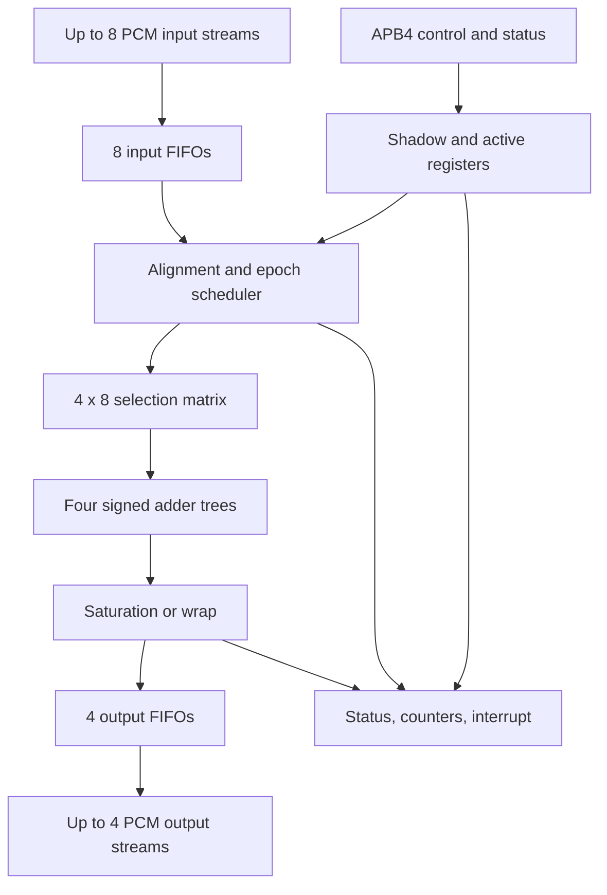
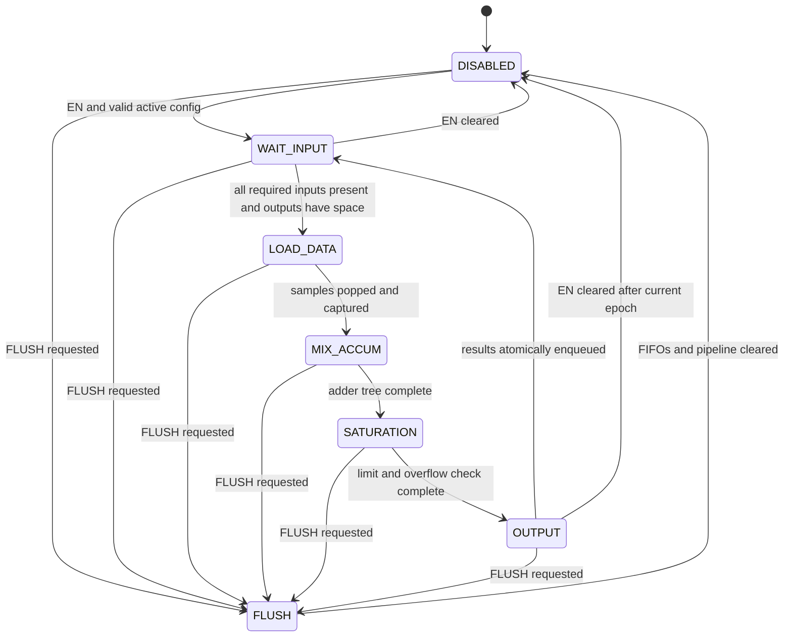

# Audio Hub Mixer IP Hardware Design Description

| Item | Value |
| --- | --- |
| Document | Hardware Design Description / IP Databook |
| IP name | Audio Hub Mixer |
| RTL module | `audio_hub_mixer` |
| Version | v1.0 |
| Status | Design baseline |
| Default sample format | Signed 32-bit PCM, two's complement |
| Maximum configuration | 8 input streams × 4 output streams |

---

## 1. Introduction

### 1.1 Purpose

This document defines the functional behavior, microarchitecture, interfaces, register map, timing, error handling, programming model, and verification requirements of the Audio Hub Mixer IP.

The Mixer combines selected synchronous PCM input samples by signed addition. It supports up to eight independent input audio streams and four independent output audio streams. Each output has its own 8-bit selection mask and may select any subset of the eight inputs. The same input sample may be used by multiple outputs, but is consumed only once per mixing epoch.

### 1.2 Scope

The IP performs only sample routing and summation:

- Maximum 8 input streams.
- Maximum 4 output streams.
- Independent input-selection mask for each output.
- Signed parallel accumulation.
- Configurable saturation or wraparound at the output width.
- Ready/valid flow control with input and output buffering.
- APB4-compatible control and status interface.

### 1.3 Explicit exclusions

The following functions are outside the Mixer:

- Gain, volume, coefficient multiplication, normalization, or gain matrix.
- Sample-rate conversion or asynchronous-rate matching.
- Automatic sample insertion, zero filling, or sample dropping.
- Channel packing, interleave, planar conversion, or slot reordering.
- DMA request generation.
- Clock-domain crossing.

Gain adjustment shall be performed by the Audio Hub Digital Gain IP. Channel packing shall be performed by the Merge IP. Any asynchronous source shall pass through a CDC FIFO or sample-rate conversion block before entering the Mixer.

### 1.4 Terminology

| Term | Definition |
| --- | --- |
| Input stream | One ordered mono PCM sample stream connected to one Mixer input port. |
| Output stream | One ordered PCM result stream produced by one Mixer output port. |
| Mixing epoch | One logical sample time in which one sample is consumed from every required input and up to four output samples are produced. |
| Selection matrix | Four 8-bit masks defining which input samples participate in each output sum. |
| Required input | An enabled input selected by at least one enabled output. |
| Atomic enqueue | All enabled output results for one epoch are committed to their output FIFOs together. |

---

## 2. Features

- Parameterizable implementation with architectural maxima of 8 inputs and 4 outputs.
- Default 32-bit signed PCM; 16-bit and 24-bit PCM are also supported through `DATA_WIDTH`.
- Four independent 8-input selection masks.
- One input may feed any number of outputs without being popped multiple times.
- Balanced signed adder tree for each output.
- Internal accumulator width of `DATA_WIDTH + 3` bits for lossless summation of eight full-scale inputs.
- Output saturation enabled by default; wraparound mode is available for compatibility.
- Per-input elastic FIFO and per-output FIFO.
- Independent output ready/valid interfaces.
- Atomic consumption and output generation at each mixing epoch.
- Atomic shadow-to-active configuration commit at an epoch boundary.
- Sticky saturation, starvation, blocked-output, configuration, and flush status.
- Per-output saturation counters and a 64-bit mixing-epoch counter.
- No combinational path from output `ready` to input `ready`.
- No multiplier or gain coefficient storage.

---

## 3. Configurable Parameters

| Parameter | Legal values | Default | Description |
| --- | ---: | ---: | --- |
| `NUM_INPUTS` | 1–8 | 8 | Implemented input stream count. |
| `NUM_OUTPUTS` | 1–4 | 4 | Implemented output stream count. |
| `DATA_WIDTH` | 16, 24, 32 | 32 | PCM input and output width. |
| `IN_FIFO_DEPTH` | Power of 2, ≥2 | 4 | Depth of each input FIFO. |
| `OUT_FIFO_DEPTH` | Power of 2, ≥2 | 4 | Depth of each output FIFO. |
| `APB_ADDR_WIDTH` | ≥12 | 12 | APB byte-address width. |

Derived parameters:

```text
ACC_WIDTH = DATA_WIDTH + ceil(log2(8))
          = DATA_WIDTH + 3
```

Ports and register fields reserved for inputs above `NUM_INPUTS` or outputs above `NUM_OUTPUTS` read as zero and ignore writes. A configuration commit that selects an unimplemented input sets `CFG_INVALID_SEL` and is rejected.

---

## 4. Functional Description

### 4.1 Mixing equation

For output `o`, input `i`, and mixing epoch `n`:

```text
select[o][i] = output_enable[o] & input_enable[i] & output_matrix[o][i]

acc[o,n] = sum(input[i,n]) for every i where select[o][i] = 1

output[o,n] = saturate_or_wrap(acc[o,n], DATA_WIDTH)
```

No coefficient multiplication is performed. A selected input contributes exactly its signed PCM value. An unselected input contributes zero.

### 4.2 Required-input mask

The scheduler derives one union mask from the active configuration:

```text
required_input_mask = input_enable &
                      ((output_enable[0] ? output_matrix[0] : 0) |
                       (output_enable[1] ? output_matrix[1] : 0) |
                       (output_enable[2] ? output_matrix[2] : 0) |
                       (output_enable[3] ? output_matrix[3] : 0));
```

One sample is popped from every required input for each epoch. An input selected by two or more outputs is still popped only once; its captured value fans out to all corresponding adder trees.

### 4.3 Valid configuration

A configuration is valid when:

1. Every selected input and enabled output is implemented.
2. Every enabled output has at least one effective source after applying `INPUT_ENABLE`.
3. Reserved bits are zero.

It is legal to disable all outputs. In that case the engine remains idle and accepts no input samples.

### 4.4 Sample alignment contract

The Mixer aligns streams by sample order, not by timestamp. The first sample popped from every required FIFO belongs to the same logical sample time, followed by the second sample from each FIFO, and so on.

Therefore:

- Required input streams shall have the same sample rate.
- Upstream logic shall start or flush the streams at a common sample boundary.
- Temporary arrival skew is absorbed by the input FIFOs.
- The Mixer waits when any required input FIFO is empty.
- The Mixer cannot detect a one-sample phase error if upstream streams were started out of alignment.

Changing the required-input set while running is atomic, but does not realign samples already stored in the newly selected input FIFO. Software should disable and flush the Mixer when a matrix change also changes stream alignment membership.

### 4.5 Input acceptance

For a currently required input:

```text
input_ready[i] = mixer_accept_enable & !input_fifo_full[i]
```

`input_ready[i]` is low for disabled or unreferenced inputs. The Mixer does not silently discard unused samples. A transfer is accepted only when `input_valid[i] && input_ready[i]` is true.

Each producer shall hold `input_valid` and `input_data` stable until the transfer is accepted.

### 4.6 Epoch scheduling

A new epoch may begin only when all of the following are true:

- Mixer is enabled.
- Active configuration is valid.
- No previous epoch is using the non-overlapped arithmetic pipeline.
- Every required input FIFO is non-empty.
- Every enabled output FIFO has at least one free entry.
- Flush or soft reset is not active.

The scheduler then pops all required inputs in the same clock cycle and captures the samples. All enabled outputs are calculated in parallel.

### 4.7 Output enqueue and backpressure

Results from one epoch are written atomically into all enabled output FIFOs. Output FIFOs drain independently through their respective ready/valid interfaces.

If one output stalls, other output FIFOs may continue draining. When the stalled output FIFO becomes full, the scheduler stops starting new epochs for all outputs. This preserves cross-output sample alignment and propagates backpressure to the required inputs.

Once asserted, `output_valid[o]` remains asserted and `output_data[o]` remains stable until `output_ready[o]` is observed high.

### 4.8 Disable and flush behavior

- Clearing `CTRL.EN` prevents new epochs from starting. In-flight arithmetic completes and already queued output data remains available to drain.
- `CTRL.FLUSH` immediately stops acceptance, invalidates in-flight work, clears all input and output FIFOs, and then sets `IRQ_STATUS.FLUSH_DONE`.
- `CTRL.SOFT_RESET` performs a flush, disables the engine, clears active and shadow configuration, status, and counters, and restores reset defaults.

`FLUSH` intentionally discards buffered audio samples and shall be used only when a discontinuity is acceptable or required for realignment.

---

## 5. System Architecture



### 5.1 Major blocks

| Block | Function |
| --- | --- |
| APB register block | Software programming, atomic configuration commit, status, and counters. |
| Input FIFO bank | Absorbs arrival skew and removes direct downstream-to-upstream combinational timing. |
| Epoch scheduler | Computes required inputs, checks readiness, pops one aligned sample set, and controls the datapath. |
| Selection matrix | Fans each captured input to any enabled output adder tree. |
| Adder trees | Perform parallel signed accumulation with full internal precision. |
| Output limiter | Detects overflow and either saturates or wraps to `DATA_WIDTH`. |
| Output FIFO bank | Holds each output independently while preserving atomic epoch generation. |
| Status and interrupt block | Reports stalls, saturation, configuration completion/errors, FIFO levels, and counters. |

---

## 6. Datapath Design

### 6.1 Input capture

At `mix_start`, the head sample of every required input FIFO is sign-extended to `ACC_WIDTH` and latched into the sample bank. Unrequired sample-bank entries are forced to zero.

### 6.2 Selection matrix

The four output matrices are independent:

```text
OUT0_MATRIX[7:0] -> inputs selected for output 0
OUT1_MATRIX[7:0] -> inputs selected for output 1
OUT2_MATRIX[7:0] -> inputs selected for output 2
OUT3_MATRIX[7:0] -> inputs selected for output 3
```

The same captured sample may be connected to all four adder trees. A one-hot matrix row implements routing/bypass without a separate bypass datapath.

### 6.3 Adder tree

Each output uses a balanced three-level tree:

```text
Level 1: s01 = x0 + x1, s23 = x2 + x3, s45 = x4 + x5, s67 = x6 + x7
Level 2: s03 = s01 + s23, s47 = s45 + s67
Level 3: acc = s03 + s47
```

All operands are sign-extended to `ACC_WIDTH` before addition. Intermediate nodes retain `ACC_WIDTH`; this width can represent the exact sum of eight `DATA_WIDTH` signed operands.

### 6.4 Saturation and wraparound

The representable output range is:

```text
MAX =  2^(DATA_WIDTH-1) - 1
MIN = -2^(DATA_WIDTH-1)
```

When `SAT_CTRL.SAT_EN = 1`:

```text
acc > MAX  -> output = MAX
acc < MIN  -> output = MIN
otherwise  -> output = acc[DATA_WIDTH-1:0]
```

When `SAT_EN = 0`, the low `DATA_WIDTH` bits are returned, producing two's-complement wraparound. Overflow detection and counters remain active in both modes.

There is no rounding step because the Mixer performs no scaling and discards no fractional bits.

### 6.5 Reference control logic

The following pseudocode is normative for transaction behavior:

```systemverilog
required_mask = active_input_enable;
required_mask &= ({8{active_output_enable[0]}} & active_matrix[0]) |
                 ({8{active_output_enable[1]}} & active_matrix[1]) |
                 ({8{active_output_enable[2]}} & active_matrix[2]) |
                 ({8{active_output_enable[3]}} & active_matrix[3]);

all_inputs_available = &(~required_mask | ~input_fifo_empty);
all_outputs_available = &(~active_output_enable | ~output_fifo_full);

mix_start = ctrl_enable && active_cfg_valid && !pipeline_busy &&
            all_inputs_available && all_outputs_available;

if (mix_start) begin
    input_fifo_pop <= required_mask;
    for (int o = 0; o < NUM_OUTPUTS; o++) begin
        if (active_output_enable[o])
            accumulator[o] <= signed_adder_tree(
                input_fifo_head,
                active_matrix[o] & active_input_enable
            );
    end
end
```

`signed_adder_tree()` above denotes the balanced three-level structure in Section 6.3; it is not a software function or a serial accumulator. The RTL shall not infer an eight-operand procedural carry chain.

---

## 7. Control State Machine



### 7.1 State behavior

| State | Behavior |
| --- | --- |
| `DISABLED` | No new input accepted and no new epoch started. Existing output FIFO entries may drain unless a flush occurred. |
| `WAIT_INPUT` | Wait for every required input sample and one free entry in every enabled output FIFO. |
| `LOAD_DATA` | Pop required input FIFOs exactly once and capture the epoch sample set. |
| `MIX_ACCUM` | Execute the three-level parallel adder tree. This state occupies three internal cycles. |
| `SATURATION` | Compare each full-precision result against the output range and select saturated or wrapped data. |
| `OUTPUT` | Atomically write all enabled results to their output FIFOs and increment the epoch counter. |
| `FLUSH` | Invalidate pipeline work and clear all input/output FIFO pointers. |

Configuration commit is serviced between epochs. It cannot modify the selection matrix of a sample set already captured by `LOAD_DATA`.

---

## 8. Interface Description

### 8.1 Clock and reset

| Signal | Direction | Width | Description |
| --- | --- | ---: | --- |
| `clk_i` | Input | 1 | Mixer core, stream, and APB clock. |
| `rst_n_i` | Input | 1 | Active-low reset; asynchronous assertion and synchronous deassertion to `clk_i`. |

The baseline IP is single-clock. If APB, producer, or consumer logic uses another clock, CDC shall be implemented outside this IP.

### 8.2 Audio input streams

| Signal | Direction | Width | Description |
| --- | --- | ---: | --- |
| `input_valid_i` | Input | `NUM_INPUTS` | Per-input sample-valid vector. |
| `input_ready_o` | Output | `NUM_INPUTS` | Per-input sample-ready vector. |
| `input_data_i` | Input | `NUM_INPUTS × DATA_WIDTH` | Signed PCM samples, one packed element per input. |

Recommended SystemVerilog declaration:

```systemverilog
input  logic [NUM_INPUTS-1:0]                  input_valid_i;
output logic [NUM_INPUTS-1:0]                  input_ready_o;
input  logic signed [NUM_INPUTS-1:0][DATA_WIDTH-1:0] input_data_i;
```

Input identity is implicit in the port index. No channel-ID sideband is required.

### 8.3 Audio output streams

| Signal | Direction | Width | Description |
| --- | --- | ---: | --- |
| `output_valid_o` | Output | `NUM_OUTPUTS` | Per-output result-valid vector. |
| `output_ready_i` | Input | `NUM_OUTPUTS` | Per-output result-ready vector. |
| `output_data_o` | Output | `NUM_OUTPUTS × DATA_WIDTH` | Signed mixed PCM result for each output. |

Recommended SystemVerilog declaration:

```systemverilog
output logic [NUM_OUTPUTS-1:0]                   output_valid_o;
input  logic [NUM_OUTPUTS-1:0]                   output_ready_i;
output logic signed [NUM_OUTPUTS-1:0][DATA_WIDTH-1:0] output_data_o;
```

### 8.4 APB4 slave interface

| Signal | Direction | Width | Description |
| --- | --- | ---: | --- |
| `paddr_i` | Input | `APB_ADDR_WIDTH` | Byte address. |
| `psel_i` | Input | 1 | Peripheral select. |
| `penable_i` | Input | 1 | Access phase enable. |
| `pwrite_i` | Input | 1 | 1 for write, 0 for read. |
| `pwdata_i` | Input | 32 | Write data. |
| `pstrb_i` | Input | 4 | Byte write strobes. |
| `prdata_o` | Output | 32 | Read data. |
| `pready_o` | Output | 1 | Access completion; tied high for implemented registers. |
| `pslverr_o` | Output | 1 | Asserted for misaligned or unmapped accesses. |

All registers are 32-bit word aligned. Byte writes are supported for RW registers. Writes to RO fields are ignored without error. Unmapped and unaligned accesses assert `pslverr_o`.

### 8.5 Interrupt

| Signal | Direction | Width | Description |
| --- | --- | ---: | --- |
| `irq_o` | Output | 1 | Level interrupt: OR of enabled sticky interrupt status bits. |

```text
irq_o = |(IRQ_STATUS & IRQ_ENABLE)
```

---

## 9. Register Map

### 9.1 Register summary

| Offset | Name | Access | Reset | Description |
| ---: | --- | --- | ---: | --- |
| `0x000` | `MIX_ID` | RO | `0x4D495831` | ASCII-like Mixer ID, `MIX1`. |
| `0x004` | `MIX_VERSION` | RO | `0x00010000` | Major 1, minor 0. |
| `0x008` | `CTRL` | RW/WO | `0x00000000` | Enable, flush, soft reset, commit, counter clear. |
| `0x00C` | `STATUS` | RO | `0x00000002` | Runtime state summary. |
| `0x010` | `INPUT_ENABLE` | RW-S | `0x00000000` | Shadow input enable mask. |
| `0x014` | `OUTPUT_ENABLE` | RW-S | `0x00000000` | Shadow output enable mask. |
| `0x018` | `OUT0_MATRIX` | RW-S | `0x00000000` | Shadow source mask for output 0. |
| `0x01C` | `OUT1_MATRIX` | RW-S | `0x00000000` | Shadow source mask for output 1. |
| `0x020` | `OUT2_MATRIX` | RW-S | `0x00000000` | Shadow source mask for output 2. |
| `0x024` | `OUT3_MATRIX` | RW-S | `0x00000000` | Shadow source mask for output 3. |
| `0x028` | `SAT_CTRL` | RW-S | `0x00000001` | Shadow saturation control. |
| `0x02C` | `CFG_STATUS` | RO | `0x00000000` | Commit sequence and configuration validity. |
| `0x030` | `IRQ_ENABLE` | RW | `0x00000000` | Interrupt enable mask. |
| `0x034` | `IRQ_STATUS` | W1C/RO | `0x00000000` | Maskable sticky interrupt status. |
| `0x038` | `ERROR_STATUS` | W1C/RO | `0x00000000` | Sticky configuration error detail. |
| `0x03C` | `STARVE_STATUS` | RO | `0x00000000` | Required empty-input indication. |
| `0x040` | `BLOCK_STATUS` | RO | `0x00000000` | Enabled full-output indication. |
| `0x044` | `IN_FIFO_EMPTY` | RO | implementation | Input FIFO empty bits. |
| `0x048` | `IN_FIFO_FULL` | RO | `0x00000000` | Input FIFO full bits. |
| `0x04C` | `OUT_FIFO_EMPTY` | RO | implementation | Output FIFO empty bits. |
| `0x050` | `OUT_FIFO_FULL` | RO | `0x00000000` | Output FIFO full bits. |
| `0x060`–`0x07C` | `IN_FIFO_LEVEL0`–`7` | RO | `0x0` | Per-input FIFO occupancy. |
| `0x080`–`0x08C` | `OUT_FIFO_LEVEL0`–`3` | RO | `0x0` | Per-output FIFO occupancy. |
| `0x090` | `MIX_COUNT_LO` | RO | `0x00000000` | Mixing-epoch counter bits `[31:0]`. |
| `0x094` | `MIX_COUNT_HI` | RO | `0x00000000` | Mixing-epoch counter bits `[63:32]`. |
| `0x098`–`0x0A4` | `SAT_COUNT0`–`3` | RO | `0x00000000` | Per-output saturating overflow counters. |
| `0x0B0` | `ACTIVE_INPUT_ENABLE` | RO | `0x00000000` | Active input enable mask. |
| `0x0B4` | `ACTIVE_OUTPUT_ENABLE` | RO | `0x00000000` | Active output enable mask. |
| `0x0B8`–`0x0C4` | `ACTIVE_OUT0_MATRIX`–`3` | RO | `0x00000000` | Active matrix rows. |
| `0x0C8` | `ACTIVE_SAT_CTRL` | RO | `0x00000001` | Active saturation control. |
| `0x0FC` | `SCRATCH` | RW | `0x00000000` | Software scratch register. |

`RW-S` denotes a shadow register. The value affects the datapath only after a successful `CFG_COMMIT`.

### 9.2 `CTRL` — offset `0x008`

| Bits | Name | Access | Reset | Description |
| ---: | --- | --- | ---: | --- |
| `[0]` | `EN` | RW | 0 | Enable starting new mixing epochs. |
| `[1]` | `FLUSH` | WO | 0 | Write 1 to flush pipeline and all FIFOs; self-clearing. |
| `[2]` | `SOFT_RESET` | WO | 0 | Write 1 for internal reset; self-clearing. |
| `[3]` | `CFG_COMMIT` | WO | 0 | Write 1 to validate and atomically activate shadow configuration. |
| `[4]` | `COUNTER_CLEAR` | WO | 0 | Write 1 to clear epoch and saturation counters. |
| `[31:5]` | Reserved | — | 0 | Write zero; read zero. |

### 9.3 `STATUS` — offset `0x00C`

| Bits | Name | Description |
| ---: | --- | --- |
| `[0]` | `ACTIVE` | `EN=1`, active configuration valid, and at least one output enabled. |
| `[1]` | `IDLE` | No arithmetic epoch is in flight. Output FIFOs may still contain data. |
| `[2]` | `PIPE_BUSY` | Datapath is processing a captured epoch. |
| `[3]` | `CFG_PENDING` | A valid commit request is waiting for the next epoch boundary. |
| `[4]` | `FLUSH_BUSY` | FIFO and pipeline flush is in progress. |
| `[5]` | `INPUT_STARVED` | At least one required input FIFO is empty. |
| `[6]` | `OUTPUT_BLOCKED` | At least one enabled output FIFO is full. |
| `[7]` | `CFG_VALID` | Active configuration passed validation. |
| `[11:8]` | `FSM_STATE` | Encoded internal state for debug. |
| `[31:12]` | Reserved | Read zero. |

### 9.4 Enable and matrix registers

#### `INPUT_ENABLE` — offset `0x010`

| Bits | Description |
| ---: | --- |
| `[7:0]` | One bit per input; 1 permits that input to participate. |
| `[31:8]` | Reserved. |

#### `OUTPUT_ENABLE` — offset `0x014`

| Bits | Description |
| ---: | --- |
| `[3:0]` | One bit per output; 1 generates an output result for each epoch. |
| `[31:4]` | Reserved. |

#### `OUTn_MATRIX` — offsets `0x018` to `0x024`

| Bits | Description |
| ---: | --- |
| `[7:0]` | `bit i = 1` selects input `i` into output `n`. |
| `[31:8]` | Reserved. |

An enabled output whose effective matrix row is zero causes the commit to fail with `CFG_ZERO_SOURCE`.

### 9.5 `SAT_CTRL` — offset `0x028`

| Bits | Name | Access | Reset | Description |
| ---: | --- | --- | ---: | --- |
| `[0]` | `SAT_EN` | RW-S | 1 | 1: clamp on overflow; 0: two's-complement wrap. |
| `[31:1]` | Reserved | — | 0 | Write zero; read zero. |

### 9.6 `CFG_STATUS` — offset `0x02C`

| Bits | Name | Description |
| ---: | --- | --- |
| `[0]` | `SHADOW_DIRTY` | A shadow register changed after the last successful commit. |
| `[1]` | `COMMIT_PENDING` | Commit accepted and waiting for a safe epoch boundary. |
| `[2]` | `ACTIVE_VALID` | Current active configuration is valid. |
| `[3]` | `LAST_COMMIT_OK` | Last completed commit succeeded. Cleared by a new commit request. |
| `[15:8]` | `CFG_SEQ` | Increments after each successful commit. Wraps naturally. |
| `[31:16]` | Reserved | Read zero. |

### 9.7 Interrupt registers

`IRQ_ENABLE` and `IRQ_STATUS` use the same bit assignments:

| Bit | Name | Set condition |
| ---: | --- | --- |
| 0 | `SAT_OUT0` | Output 0 full-precision sum exceeded the output range. |
| 1 | `SAT_OUT1` | Output 1 full-precision sum exceeded the output range. |
| 2 | `SAT_OUT2` | Output 2 full-precision sum exceeded the output range. |
| 3 | `SAT_OUT3` | Output 3 full-precision sum exceeded the output range. |
| 4 | `INPUT_STARVE` | Scheduler first enters a wait caused by a required empty input. |
| 5 | `OUTPUT_BLOCKED` | Scheduler first enters a wait caused by an enabled full output FIFO. |
| 6 | `CFG_DONE` | Shadow configuration was successfully activated. |
| 7 | `CFG_ERROR` | Configuration commit was rejected. |
| 8 | `FLUSH_DONE` | Requested flush completed. |
| 31:9 | Reserved | Read zero. |

`IRQ_STATUS` bits are sticky and cleared by writing 1. Saturation status is set even when wrap mode is selected.

### 9.8 `ERROR_STATUS` — offset `0x038`

| Bit | Name | Meaning |
| ---: | --- | --- |
| 0 | `CFG_ZERO_SOURCE` | At least one enabled output has no effective selected input. |
| 1 | `CFG_INVALID_SEL` | Configuration selected an unimplemented input or output. |
| 2 | `CFG_BUSY` | A commit was requested while another commit was pending. |
| 3 | `CFG_RESERVED` | A reserved configuration bit was written as 1. |
| 31:4 | Reserved | Read zero. |

Errors are sticky W1C. A failed commit does not alter the active configuration.

### 9.9 FIFO status

- `STARVE_STATUS[7:0]`: bit `i` is 1 when input `i` is required and its FIFO is empty.
- `BLOCK_STATUS[3:0]`: bit `o` is 1 when output `o` is enabled and its FIFO is full.
- FIFO empty/full registers contain one bit per implemented FIFO.
- Each FIFO-level register reports occupancy from zero through the configured depth.

### 9.10 Counters

- `MIX_COUNT` increments once when one epoch is atomically enqueued.
- `SAT_COUNTn` increments for every overflowing epoch on output `n`, regardless of saturation mode.
- Saturation counters stop at `0xFFFF_FFFF` rather than wrapping.
- `CTRL.COUNTER_CLEAR` clears all counters atomically.
- Software should read `MIX_COUNT_HI`, then `MIX_COUNT_LO`, then `MIX_COUNT_HI` again and retry if the high word changed.

---

## 10. Configuration Commit Model

### 10.1 Shadow and active banks

`INPUT_ENABLE`, `OUTPUT_ENABLE`, `OUT0_MATRIX` through `OUT3_MATRIX`, and `SAT_CTRL` form the shadow bank. The datapath reads only the active bank.

Writing `CTRL.CFG_COMMIT=1` performs the following:

1. Validate all shadow fields.
2. If invalid, retain the current active bank and set the appropriate error and interrupt bits.
3. If valid and no epoch is in flight, copy the shadow bank to active on the next clock.
4. If valid and an epoch is in flight, set `CFG_PENDING` and copy at the boundary after that epoch is enqueued.
5. Increment `CFG_SEQ` and set `CFG_DONE` after activation.

This prevents a partial matrix update from affecting one audio sample.

### 10.2 Output FIFO transition behavior

Configuration commit does not clear output FIFOs. Samples already queued retain the old configuration, followed by newly generated samples using the new configuration. Use disable, drain or flush, commit, and restart when a hard stream boundary is required.

---

## 11. Timing and Performance

### 11.1 Handshake rules

An input transfer occurs on:

```text
input_valid_i[i] && input_ready_o[i]
```

An output transfer occurs on:

```text
output_valid_o[o] && output_ready_i[o]
```

FIFO pointers advance only on the corresponding handshake. Data shall remain stable while valid is high and ready is low.

### 11.2 Core latency

The baseline non-overlapped datapath has a nominal five-clock processing latency from scheduler acceptance to output FIFO enqueue:

| Relative cycle | Operation |
| ---: | --- |
| 0 | Scheduler starts the epoch; pop and capture required inputs. |
| 1 | Adder-tree level 1. |
| 2 | Adder-tree level 2. |
| 3 | Adder-tree level 3. |
| 4 | Saturation/wrap selection and overflow detection. |
| 5 | Atomic output FIFO write. |

The observable end-to-end latency may be longer due to input starvation or output backpressure.

### 11.3 Throughput

- Baseline epoch initiation interval: 5 clocks.
- Core epoch capacity: `f_clk / 5` samples per second per enabled output.
- Each input FIFO may accept at most one sample per clock.
- Each output interface may transfer at most one sample per clock.

For a target sample rate `Fs`, the functional minimum core clock is:

```text
f_clk >= 5 × Fs
```

Clock, APB activity, FIFO recovery, implementation margin, and timing closure requirements shall be added at SoC level.

### 11.4 Backpressure timing

Input `ready` depends only on active configuration, local input-FIFO fullness, enable, reset, and flush. It has no combinational dependence on any output `ready` signal. Output backpressure propagates through registered FIFO state and scheduler control.

---

## 12. Reset and Clocking

### 12.1 Reset values

After `rst_n_i` is asserted low:

- Mixer is disabled.
- Input and output enable masks are zero.
- All matrix rows are zero.
- Saturation is enabled in shadow and active banks.
- Input and output FIFOs are empty.
- Pipeline valid bits are clear.
- `output_valid_o` and `input_ready_o` are low.
- Interrupt, error, and counter registers are clear.
- `STATUS.IDLE` is high.

### 12.2 Reset implementation

Reset may assert asynchronously, but shall deassert synchronously to `clk_i`. Integration logic shall not gate `clk_i` until reset deassertion has propagated through the IP.

### 12.3 Clock gating

The implementation may gate the adder-tree and sample-bank clocks when no epoch is active. The register block and any state required to observe APB writes and deassert reset shall remain clocked. Clock gating shall use integrated clock-gating cells in the implementation flow.

---

## 13. Programming Sequence

### 13.1 Initial configuration

1. Keep `CTRL.EN=0`.
2. Issue `CTRL.FLUSH=1` and wait for `IRQ_STATUS.FLUSH_DONE` or `STATUS.FLUSH_BUSY=0`.
3. Program `INPUT_ENABLE`.
4. Program `OUTPUT_ENABLE`.
5. Program `OUT0_MATRIX` through `OUT3_MATRIX`.
6. Program `SAT_CTRL`.
7. Clear stale `IRQ_STATUS` and `ERROR_STATUS` bits with W1C writes.
8. Issue `CTRL.CFG_COMMIT=1`.
9. Wait for `CFG_STATUS.LAST_COMMIT_OK=1`; handle `CFG_ERROR` otherwise.
10. Set `CTRL.EN=1`.
11. Enable required interrupt sources in `IRQ_ENABLE`.

### 13.2 Safe runtime reconfiguration

For a matrix change among already aligned active streams:

1. Write the new shadow masks.
2. Issue `CFG_COMMIT`.
3. Wait for `CFG_DONE`.

For a change that adds or removes independently started streams:

1. Clear `CTRL.EN`.
2. Drain required outputs or issue `FLUSH`.
3. Realign/restart upstream producers.
4. Program and commit the new matrix.
5. Set `CTRL.EN`.

### 13.3 Graceful stop

1. Clear `CTRL.EN` to stop new epochs.
2. Wait for `STATUS.PIPE_BUSY=0`.
3. Allow output FIFOs to drain until `OUT_FIFO_EMPTY` reports all implemented outputs empty.
4. Flush only if buffered output data should be discarded.

---

## 14. Configuration Examples

### 14.1 Direct route

Route input 0 unchanged to output 0:

```text
INPUT_ENABLE  = 0x01
OUTPUT_ENABLE = 0x01
OUT0_MATRIX   = 0x01
SAT_CTRL      = 0x01
```

Because only one source is selected, `OUT0[n] = IN0[n]` bit-exactly.

### 14.2 Four independent mixes

```text
OUT0 = IN0 + IN2 + IN5      OUT0_MATRIX = 0x25
OUT1 = IN1 + IN3 + IN7      OUT1_MATRIX = 0x8A
OUT2 = IN0 + IN4            OUT2_MATRIX = 0x11
OUT3 = IN6 + IN7            OUT3_MATRIX = 0xC0

INPUT_ENABLE  = 0xFF
OUTPUT_ENABLE = 0x0F
```

Inputs 0 and 7 are each used by two outputs, but each input FIFO is popped only once per epoch.

### 14.3 Fanout without mixing

Send input 2 to outputs 0, 1, and 3:

```text
INPUT_ENABLE  = 0x04
OUTPUT_ENABLE = 0x0B
OUT0_MATRIX   = 0x04
OUT1_MATRIX   = 0x04
OUT2_MATRIX   = 0x00
OUT3_MATRIX   = 0x04
```

### 14.4 Saturation example for 32-bit PCM

```text
IN0 = 0x7FFF_FFF0
IN1 = 0x0000_0020
OUT0_MATRIX = 0x03

full_precision_sum = 0x000_8000_0010
SAT_EN = 1 -> OUT0 = 0x7FFF_FFFF
SAT_EN = 0 -> OUT0 = 0x8000_0010
```

The `SAT_OUT0` status bit and `SAT_COUNT0` increment in both modes.

---

## 15. Error and Corner-Case Behavior

| Condition | Required behavior |
| --- | --- |
| Required input empty | Wait without popping any input; set starvation status. |
| Enabled output FIFO full | Wait without popping any input; set blocked status. |
| Output not ready | Hold valid and data stable; other outputs may drain. |
| Same input selected by several outputs | Read and pop the input once; fan out the captured sample. |
| Input selected by no enabled output | Deassert its ready and do not consume it. |
| Enabled output has zero effective sources | Reject configuration commit. |
| Positive/negative arithmetic overflow | Set status/counter; saturate or wrap according to `SAT_EN`. |
| `EN` cleared during an epoch | Finish and enqueue the current epoch; do not start another. |
| Flush during an epoch | Discard the in-flight epoch and all FIFO contents. |
| Reset while output is stalled | Clear output valid and discard buffered data. |
| New commit while one is pending | Reject the new request and set `CFG_BUSY`. |

The ready/valid protocol prevents FIFO overflow and underflow in correct integrations. The Mixer never pops an empty input FIFO and never pushes a full output FIFO.

---

## 16. Integration Guidelines

### 16.1 Recommended Audio Hub chain


- The crossbar routes complete stream transactions and shall not modify sample values.
- Digital Gain is placed before or after Mixer according to system headroom requirements; Mixer itself remains coefficient-free.
- Merge is used after Mixer when multiple output streams must be packed into one interleaved or planar transport stream.
- All Mixer inputs participating in one configuration shall refer to the same sample timeline.

### 16.2 Headroom

Summing correlated full-scale inputs can overflow even though the internal accumulator is lossless. Saturation prevents numeric wrap but may create audible clipping. The system should provide headroom by attenuating sources in a separate Digital Gain stage when necessary.

### 16.3 CDC

No stream or APB CDC is present inside the baseline IP. An asynchronous FIFO shall be used for discrete clock domains. CDC FIFOs for streams mixed together shall be released or flushed at a common logical frame boundary.

---

## 17. Verification Requirements

### 17.1 Functional tests

- Reset values and reset during every FSM state.
- One-hot direct routing for every input-to-output pair.
- All-zero disabled configuration.
- Every legal 8-bit matrix row and representative full 4×8 matrices.
- One input fanned out to all four outputs.
- Full 8-input sum on all four outputs.
- Positive and negative overflow in saturation and wrap modes.
- Minimum, maximum, zero, and alternating-sign PCM values.
- Input and output enable behavior.
- Atomic configuration change at each possible epoch boundary.
- Configuration rejection and preservation of the previous active bank.
- Flush, graceful disable, and soft reset.

### 17.2 Flow-control tests

- Independent random valid gaps on all inputs.
- Independent random ready stalls on all outputs.
- One permanently stalled output until its FIFO becomes full.
- Simultaneous input starvation and output blocking.
- FIFO wraparound, full-to-not-full, and empty-to-not-empty transitions.
- Stable output data while valid is high and ready is low.
- No input pop unless a complete epoch can start.

### 17.3 Arithmetic reference model

The scoreboard shall:

1. Maintain an ordered queue per input.
2. Build each epoch from the active required-input mask.
3. Compute each output using unbounded signed precision.
4. Apply the selected saturation or wrap rule.
5. Compare independent ordered queues for each output.

### 17.4 Required assertions

```systemverilog
// Output must remain stable while stalled.
assert property (@(posedge clk_i) disable iff (!rst_n_i)
    output_valid_o[o] && !output_ready_i[o] |=>
    output_valid_o[o] && $stable(output_data_o[o]));

// Empty input FIFO shall never be popped.
assert property (@(posedge clk_i) disable iff (!rst_n_i)
    input_fifo_pop[i] |-> !input_fifo_empty[i]);

// Full output FIFO shall never be pushed.
assert property (@(posedge clk_i) disable iff (!rst_n_i)
    output_fifo_push[o] |-> !output_fifo_full[o]);

// Every required input is popped together at epoch start.
assert property (@(posedge clk_i) disable iff (!rst_n_i)
    mix_start |-> (input_fifo_pop == required_input_mask));

// All enabled outputs are pushed atomically for an epoch.
assert property (@(posedge clk_i) disable iff (!rst_n_i)
    epoch_commit |-> (output_fifo_push == active_output_enable));
```

Assertions shall be generated only for implemented ports and adapted to the final FIFO signal naming.

### 17.5 Coverage goals

- Every input selected by every output.
- Matrix row population counts from 1 through 8.
- All four outputs enabled simultaneously.
- Each output experiences positive and negative overflow.
- Commit while disabled, waiting, accumulating, and outputting.
- Flush from every reachable state.
- Backpressure crossing every FIFO boundary condition.

---

## 18. Synthesis and Implementation Notes

- Use a balanced adder tree; do not infer an eight-operand serial carry chain.
- Preserve signed declarations and explicit sign extension at the sample-bank boundary.
- Register adder-tree levels as required by the target frequency; the architectural latency in this specification assumes three registered levels.
- Input and output FIFO storage may use flops or small SRAM/register-file macros according to depth and technology.
- Avoid combinational ready loops across IP boundaries.
- Constrain `rst_n_i` deassertion as synchronous to `clk_i`.
- Clock-gating enables shall be generated from registered state and implemented with approved ICG cells.
- APB and audio paths should have separate synthesis path groups because their timing characteristics differ.

---

## 19. Compliance Summary

An implementation conforms to this HDD when it:

1. Supports up to eight signed PCM input streams and four output streams.
2. Allows each output to independently select any subset of inputs.
3. Pops a shared input only once per epoch even when several outputs select it.
4. Performs only addition/routing, with no gain coefficient or multiplier.
5. Uses full-width signed accumulation and the specified saturation/wrap behavior.
6. Preserves ready/valid semantics under arbitrary legal backpressure.
7. Starts no epoch until all required input samples and output FIFO capacity are available.
8. Applies matrix configuration atomically at an epoch boundary.
9. Implements the register, reset, status, and error behavior defined above.

---

## Appendix A. Default Top-Level Skeleton

```systemverilog
module audio_hub_mixer #(
    parameter int NUM_INPUTS     = 8,
    parameter int NUM_OUTPUTS    = 4,
    parameter int DATA_WIDTH     = 32,
    parameter int IN_FIFO_DEPTH  = 4,
    parameter int OUT_FIFO_DEPTH = 4,
    parameter int APB_ADDR_WIDTH = 12
) (
    input  logic clk_i,
    input  logic rst_n_i,

    input  logic [NUM_INPUTS-1:0] input_valid_i,
    output logic [NUM_INPUTS-1:0] input_ready_o,
    input  logic signed [NUM_INPUTS-1:0][DATA_WIDTH-1:0] input_data_i,

    output logic [NUM_OUTPUTS-1:0] output_valid_o,
    input  logic [NUM_OUTPUTS-1:0] output_ready_i,
    output logic signed [NUM_OUTPUTS-1:0][DATA_WIDTH-1:0] output_data_o,

    input  logic [APB_ADDR_WIDTH-1:0] paddr_i,
    input  logic                      psel_i,
    input  logic                      penable_i,
    input  logic                      pwrite_i,
    input  logic [31:0]               pwdata_i,
    input  logic [3:0]                pstrb_i,
    output logic [31:0]               prdata_o,
    output logic                      pready_o,
    output logic                      pslverr_o,

    output logic irq_o
);

    localparam int ACC_WIDTH = DATA_WIDTH + 3;

    // Register block, FIFO banks, scheduler, selection matrix,
    // four adder trees, output limiter, and interrupt logic.

endmodule
```

---

## Appendix B. Revision History

| Version | Date | Description |
| --- | --- | --- |
| v1.0 | 2026-07-22 | Initial complete Mixer IP HDD: 8 inputs, 4 outputs, independent selection matrix, no gain, saturation, buffering, APB registers, and verification requirements. |
