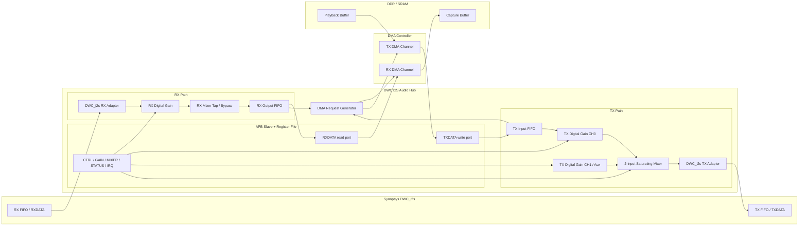

# RTL Block Diagram

## Top-level architecture



## DMA endpoint model

```text
RX DMA source      = AUDIO_HUB_BASE + RXDATA
TX DMA destination = AUDIO_HUB_BASE + TXDATA

RX source increment = fixed
TX destination increment = fixed
```

## Processing order

```text
RX: DWC_i2s -> gain -> optional mixer tap/bypass -> DMA
TX: DMA -> gain -> mixer -> DWC_i2s
```
